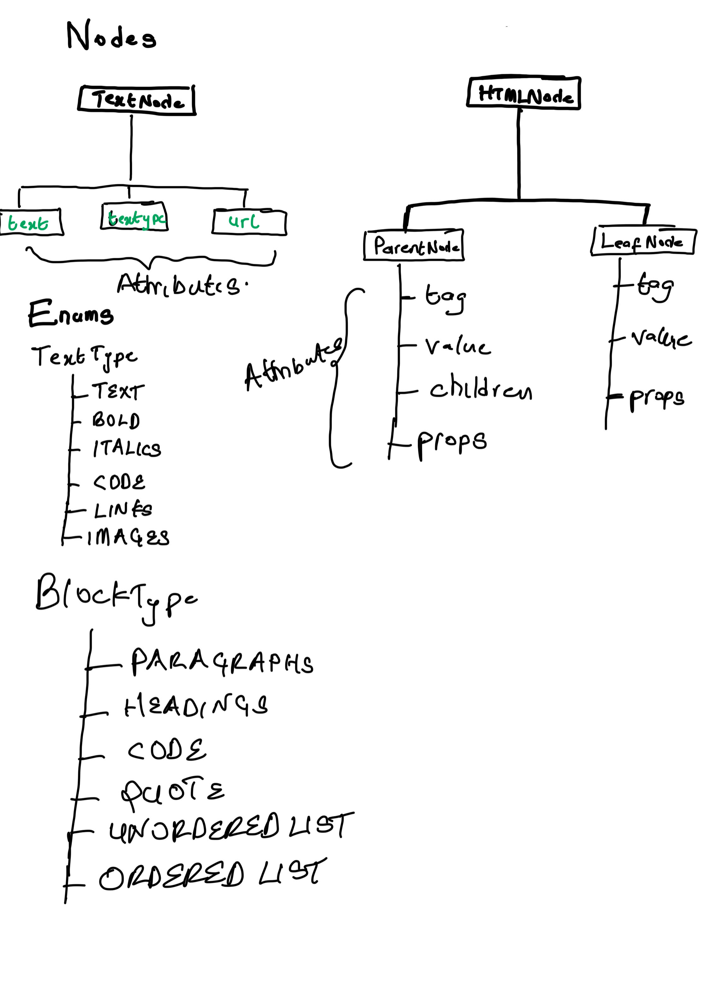
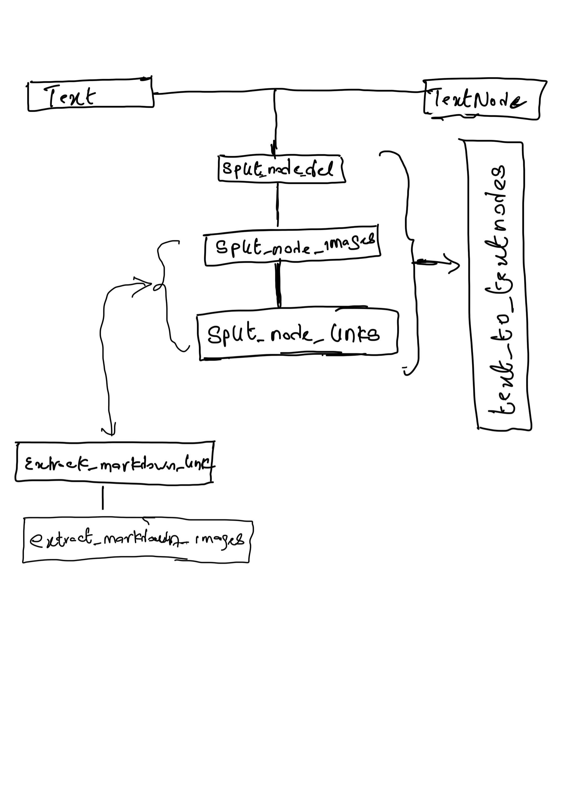

# Static-Site-Generator

This an Intelligent system that converts markdown page into an HTML page as a blog

## Architecture of the System

## TextNode

Attributes:

* text - The text
* textype - The type of the text, whether a `TEXT`, `BOLD`, `ITALICS`, `CODE`, `LINKS`, `IMAGES`.
* Url - Depending on whether the textype is an image or a link, it would have this attribute or else it is `None`.

## HTMLNode

The HTMLNode is the class for HTML tag objects. We have 2 child class of this class which are the ParentNode and LeafNode. This difference between the ParentNode and the LeafNode is that the ParentNode, just like the name has children of HTMLNodes while the LeadNode has no children. We catered for this in our inherited class code.

Attributes:

* tag - the HTML tag of the block, whether a `p`, `b`, `h1` etc.
* value - The content or text in the tag.
* children - This is another HTMLNode, only the ParentNode has childrens.
* props: This is a dictionary of attributes in the HTML tags. Images and links always have this attributes.

## Enums

### TextType

We used sumtypes to cater for cases of text type:

* TEXT - This is when all the content is a text.
* BOLD - This is when we the text is a bolded text (**boy**).
* ITALIC - When the text is in italics (__boy__).
* CODE - When the text is a code (`fn boy()`).
* LINK - When the text is a link (`[bootdev](https://i.imgur.com/zjjcJKZ.png)`).
* IMAGES - When the text is an image (``).

### BlockType

We used sumtypes here also. For each block in the markdown, they can either be of the following types:

* PARAGRAPHS - A paragraph block
* HEADINGS - In markdown, a paragraph block starts with either one (1) to six(6) hash (#) depending on the six of the header.
* CODE - a code block begins and ends with a tick (``).
* QU0TE - a quote in markdown starts with a arrow character (>).
* UNORDERED LIST - An unordered list in markdown starts with a dash and dot followed by the text (`- boy`).
* ORDERED LIST - An ordered list in markdown starts with a number followed by a . character and a space. The number must start at 1 and increment by 1 for each line.

